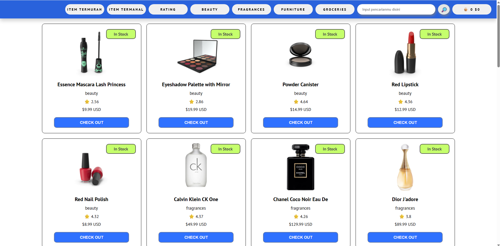
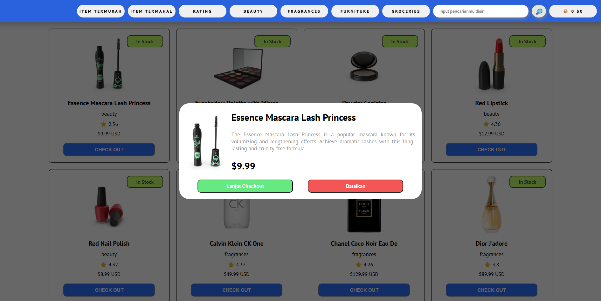
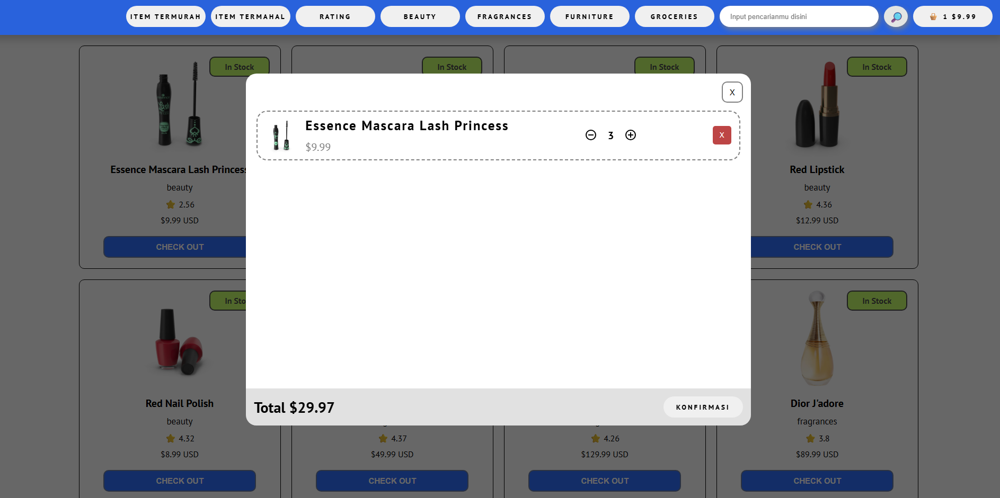
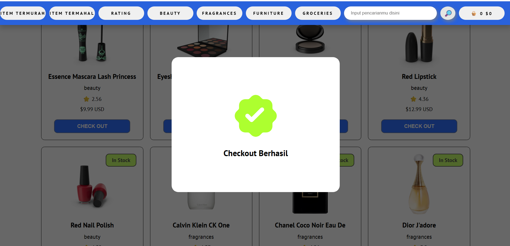
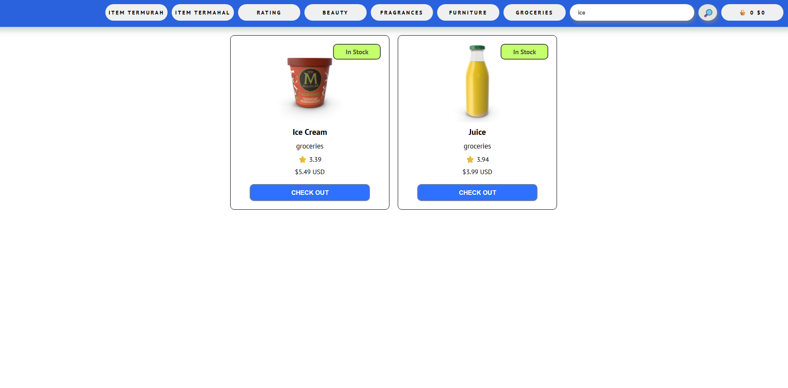
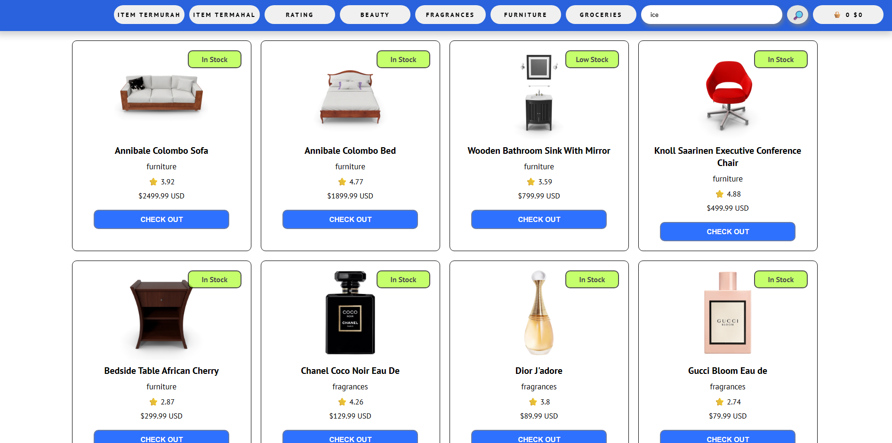

# javascript-product-catalog

# 🛒 Product Catalog & Shopping Cart

A modern e-commerce product catalog built using **Vanilla JavaScript (ES6 Modules)** without any frontend framework.

This application consumes product data from the **DummyJSON REST API** and renders all products dynamically into the browser.

## 🌐 Live Demo

🔗 **https://javascript-product-catalog.vercel.app/**

Try the application here:
https://javascript-product-catalog.vercel.app/

---

**API Endpoint**

> https://dummyjson.com/products

The project was created as part of my JavaScript learning journey before moving on to React. Instead of following a step-by-step tutorial, I focused on understanding the logic behind modern frontend development by building every feature manually using Vanilla JavaScript.

---

## 📸 Preview

### Home Page



### Product Detail



### Shopping Cart



### Checkout Success



### Pencarian Refresh Real Time



### Sorting Items



---

# ✨ Features

- 📦 Fetch products from DummyJSON REST API
- 🔍 Real-time product search
- 🏷 Category filtering
- 📊 Product sorting
  - Lowest Price
  - Highest Price
  - Highest Rating
- 📄 Product detail popup
- 🛒 Shopping cart
- ➕ Increase product quantity
- ➖ Decrease product quantity
- ❌ Automatically remove product when quantity reaches zero
- 💰 Automatic total price calculation based on cart state
- 💾 LocalStorage persistence
- ✅ Checkout confirmation
- 🎉 Checkout success popup

---

# 🧠 What I Learned

During the development of this project, I practiced and strengthened my understanding of:

- DOM Manipulation
- ES6 Modules
- Fetch API
- Async / Await
- Event Handling
- LocalStorage
- Object References
- State Management using Vanilla JavaScript
- Dynamic UI Rendering
- REST API Consumption
- Modular Application Architecture

I also learned to treat the shopping cart as the **Single Source of Truth**, where:

- The UI is rendered based on cart data.
- The total price is calculated from the cart instead of being updated manually.
- LocalStorage stays synchronized with the current application state.

This approach makes the application easier to maintain and reduces synchronization bugs.

---

# 🛠 Tech Stack

- HTML5
- CSS3
- Vanilla JavaScript (ES6 Modules)
- Fetch API
- LocalStorage
- DummyJSON REST API

---

# 📂 Project Structure

```text
├── app.js
├── productApi.js
├── katalog.js
├── popup.js
├── keranjang.js
├── kategori.js
├── search.js
├── sort.js
├── productSummary.js
├── style.css
└── index.html
```

---

# 🚀 Getting Started

Clone this repository

```bash
git clone https://github.com/your-username/product-catalog.git
```

Move into the project

```bash
cd product-catalog
```

Run the project using **Live Server** or any local development server.

---

# 🎯 Future Improvements

- Responsive mobile layout
- Pagination
- Loading skeleton
- Toast notifications
- Dark mode
- Product favorites (Wishlist)
- Better code refactoring
- Checkout animation

---

# 📖 About This Project

This project was intentionally built using **Vanilla JavaScript** without React, Vue, or other frontend frameworks.

The objective was to gain a deeper understanding of how frontend applications work internally by implementing features such as:

- Dynamic DOM rendering
- Shopping cart management
- Quantity handling
- LocalStorage synchronization
- State management
- Event-driven programming

Building these features manually helped me understand the concepts that modern frameworks like **React** abstract and simplify.

---

## 👨‍💻 Author

**Yusril Fahmi**

If you like this project, feel free to ⭐ this repository.
